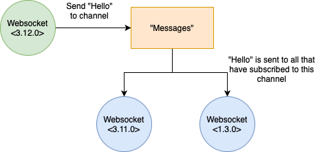

# Nova Pubsub

With version 0.9.4 we introduced the concept of a pubsub-like mechanism in Nova so that users can build distributed services. Internally it relies on Erlangs `pg2`-module which enables distributed named process groups. The concept is really simple and there's not much depth in the current implementation - it should only be used as a simple message bus. If you need more advanced features please take a look at [RabbitMQ](rabbitmq) or [MQTT](https://mqtt.org).

## Basic concepts

The idea is that a process subscribes to a *topic*. If there's any messages sent to this topic all the *subscribed* processes receivs that message.



*This picture shows how two processes have subscribed to a topic (Or channel) "Messages". When another process then sends *"Hello"* on this topic the other two will receive it.

## Example
```erlang
-module(test_module).
-export([player1/0,
         player2/0,
         start_game/0]).

player1() ->
  spawn(fun() ->
    nova_pubsub:join(game_of_pong),
    game_loop(1, "pong", "ping")
  end).

player2() ->
  spawn(fun() ->
    nova_pubsub:join(game_of_pong),
    game_loop(2, "ping", "pong")
  end).

game_loop(Player, ExpectedMessage, Smash) ->
  receive
    ExpectedMessage ->
      io:format("Player ~d received ~s and returning ~s~n", [Player, ExpectedMessage, Smash]),
      nova_pubsub:broadcast(game_of_pong, "match1", Smash),
      game_loop(Player, ExpectedMessage, Smash);
  _ ->
      game_loop(Player, ExpectedMessage, Smash)
  end.
```
Here we are subscribing to a topic *"game_of_pong"* which we later use to send either ping or pong to, depending on which player that are serving.
This can ofcourse be extended to do so much more, but this is a taste of what one can use nova_pubsub to.


## Configuration

It does not require any specific parameters set in order to work. Just remember to enable *distributed erlang*.
